# Wiatr & Woda Dębki — Mobile-first website for a seaside accommodation property

A responsive, mobile-first website for a seaside accommodation property in Dębki, Poland. The project presents apartments and rooms, amenities, local information, contact details, Google Maps location and a reservation inquiry flow — all in a clean, conversion-focused mobile UX.

**Live website:** [wiatriwodadebki.pl](https://wiatriwodadebki.pl)

---

## Overview

Wiatr & Woda Dębki is a real accommodation property located at Rybacka 10 in Dębki — a quiet seaside village on the Polish Baltic coast, close to sandy beaches, a pine forest and the Nadmorski Landscape Park.

The website was built as a practical landing page to:

- Present the full apartment and room offer with prices, photos and key details
- Enable fast reservation inquiries via a web form (routed to the owner's inbox)
- Help guests discover the local area (Dębki guide section)
- Drive direct bookings through clear, conversion-focused CTAs: *Zarezerwuj pobyt*, *Zadzwoń*, *Zapytaj o dostępność*

**Mobile-first** is the core design decision: most accommodation searches happen on smartphones, and the guest's first contact with the property is typically on a small screen. Every layout decision was made for mobile first, then progressively enhanced for wider viewports.

The project is informed by practical experience in hospitality and short-term rental operations — building an understanding of what information guests actually look for, in what order, and what frictions prevent them from making a reservation inquiry.

---

## Key Features

- **Mobile-first responsive layout** — CSS Grid and Flexbox, tested on real mobile screens
- **Apartment / room offer cards** — price range, capacity, key amenities, direct CTA
- **Swipeable image carousel** — touch-friendly gallery on mobile, no arrow-click required
- **Lightbox gallery** — full-size photo preview on tap/click
- **Amenities grid** — visually grouped into icon cards (Wi-Fi, parking, playground, pet-friendly)
- **Location chips** — quick scannable highlights (beach proximity, forest, parking, Wi-Fi)
- **Local guide section** — Dębki area info to help guests plan their stay
- **Google Maps embed** — property location with full address
- **Contact section** — phone, e-mail, Instagram and Facebook links
- **Reservation inquiry form** — name, phone, e-mail, dates and notes; submissions go to owner's inbox via web3forms
- **Scroll reveal animations** — sections animate in as the user scrolls down
- **Sticky mobile navigation** with hamburger menu and phone CTA button always visible
- **Smooth scroll** with sticky header offset compensation
- **SEO ready** — JSON-LD structured data (`LodgingBusiness`), Open Graph tags, canonical URL, meta description
- **Accessibility** — `skip to content` link, `aria-label`, `sr-only` labels, `aria-expanded` on toggle

---

## UX / Business Logic

The page is structured as a guided funnel:

1. **Hero** — immediate visual impression with seaside image and two primary CTAs (*Book a stay* / *Call us*)
2. **About card** — brief context about the property: built in 2025, quiet location, close to sea and forest
3. **Amenities** — scannable grid of key selling points (Wi-Fi, playground, pets allowed, free parking)
4. **Offer section** — apartment and room cards with swipeable photo carousels, pricing and a direct *Ask about availability* link
5. **Gallery** — full property gallery with lightbox; builds trust before inquiry
6. **Dębki section** — local area guide with chips and an embedded Google Map
7. **Contact + Reservation form** — final conversion step: call, social or form inquiry

On mobile, the photo gallery can be swiped with a finger — no need to tap navigation arrows. The phone CTA button (`☎`) is always visible in the top-right corner of the navigation bar, enabling one-tap calls at any point in the scroll.

Form submissions include reservation dates, guest details and notes, and are forwarded to the owner's e-mail inbox. No backend or server required — handled via web3forms API.

---

## Screenshots

> Screenshots placed in `assets/screenshots/mobile/`. Add your mobile captures with the filenames below.

### Mobile-first homepage

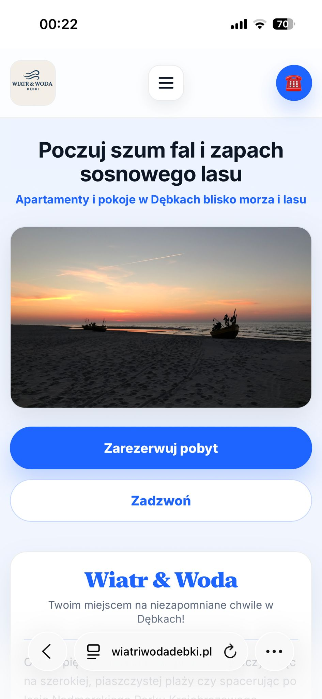

*Hero section with main CTA ("Zarezerwuj pobyt" / "Zadzwoń") and seaside visual identity.*

### Offer and apartment cards

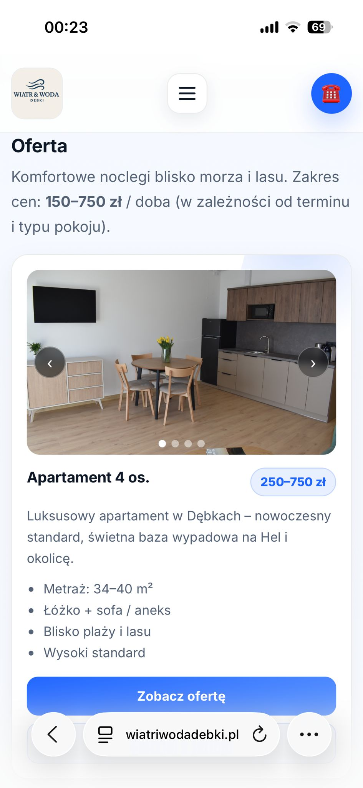
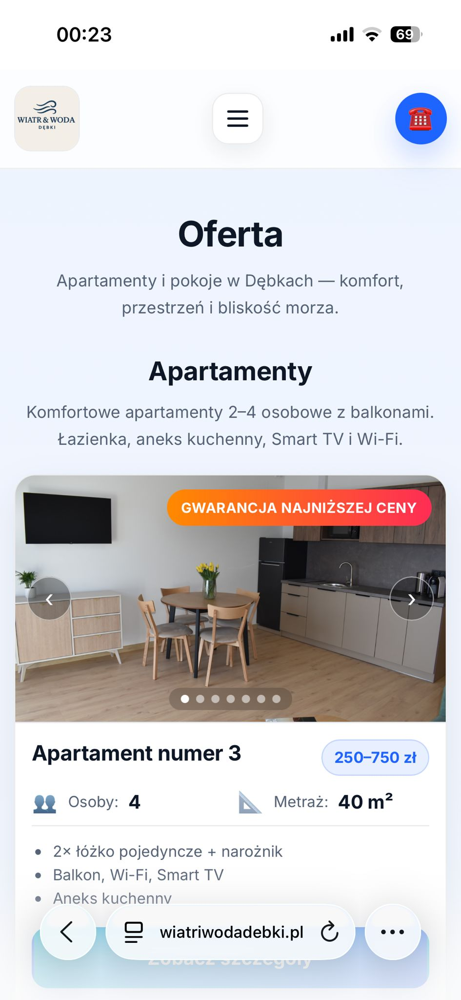

*Mobile cards presenting apartments and rooms with price range, capacity and key details. Each card includes a swipeable photo carousel.*

### Apartment details

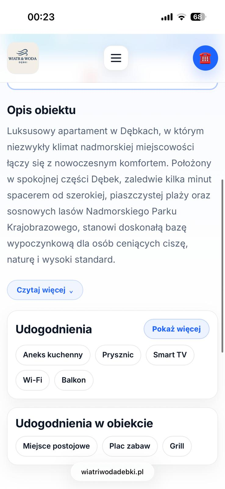
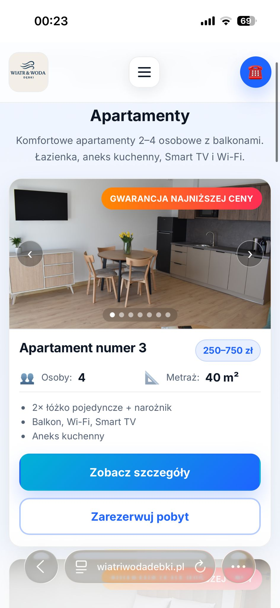
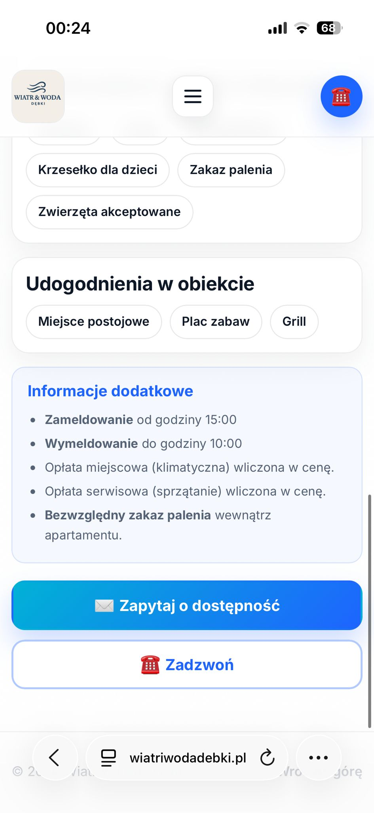

*Detailed apartment page with expandable description, grouped amenities and reservation CTA.*

### Local guide and navigation

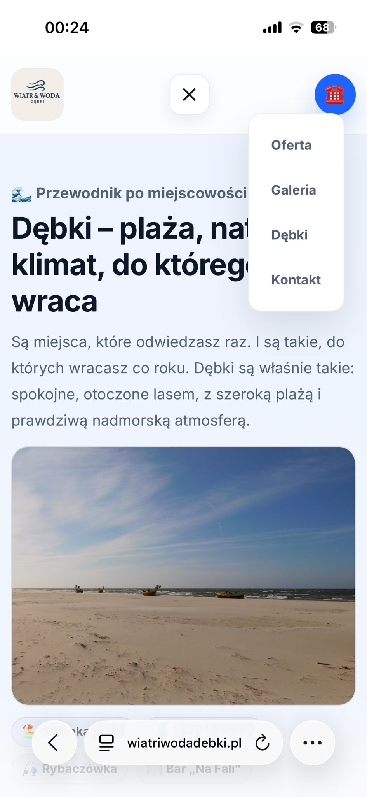
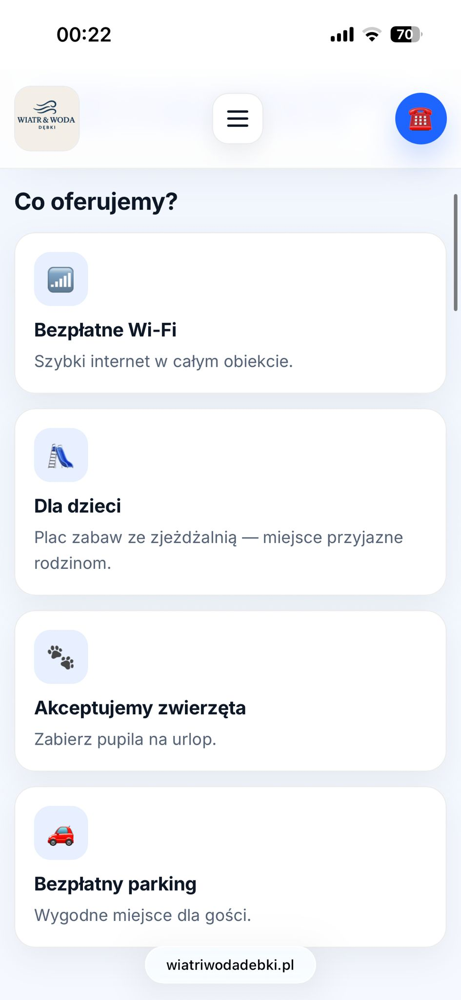

*Mobile navigation menu and local Dębki guide section for guests planning their stay.*

### Location and contact

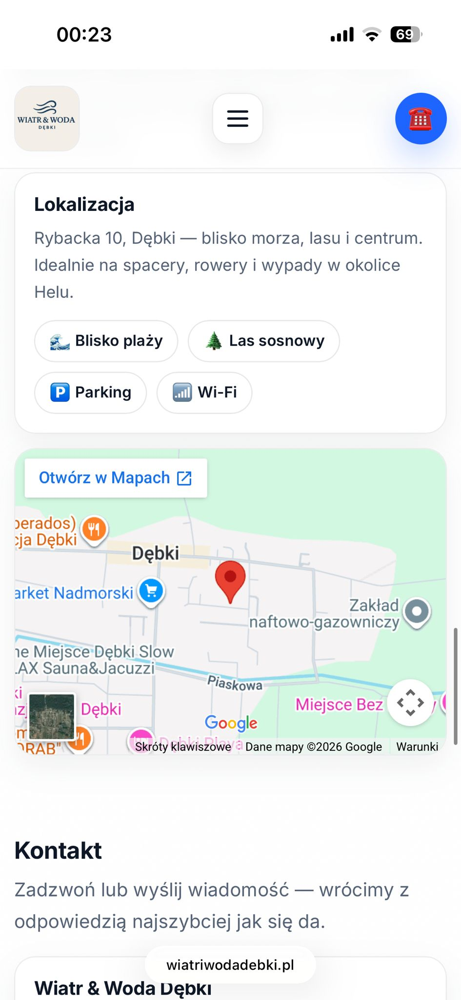
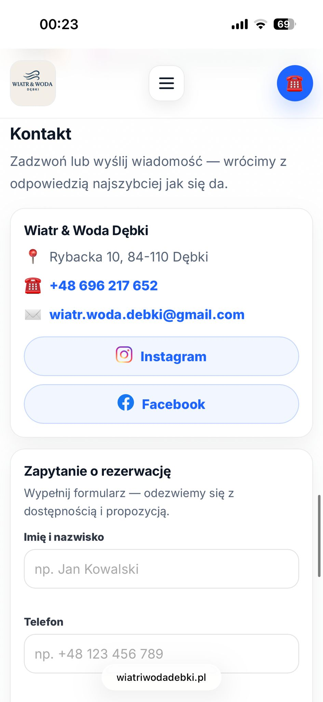
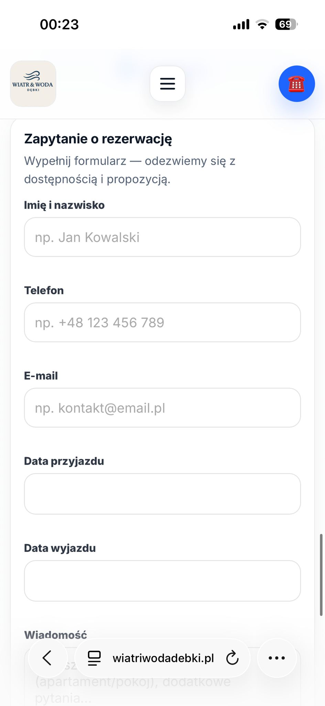

*Embedded Google Maps location, contact card with phone and social links, and the reservation inquiry form.*

---

## Tech Stack

| Layer | Technology |
|---|---|
| Markup | HTML5 (semantic elements, ARIA) |
| Styles | CSS3 — custom properties, CSS Grid, Flexbox, `@media` queries |
| Scripts | Vanilla JavaScript (ES6+) — no framework, no build step |
| Fonts | Google Fonts — Inter (400/500/600/700/800) |
| Maps | Google Maps Embed API |
| Forms | [web3forms](https://web3forms.com) — serverless form-to-email |
| SEO | JSON-LD (`LodgingBusiness`), Open Graph, canonical, meta description |
| Hosting | Static file hosting (no server-side rendering) |

No npm, no bundler, no framework. The entire site is a set of static files deployable to any host.

---

## What I Learned / Implemented

- Designing mobile-first interfaces from scratch — layout decisions made for 375px viewport first
- Building a real business landing page with a clear conversion funnel
- Structuring offer pages: balancing visual richness (carousels, galleries) with fast load time
- Implementing a touch-friendly swipeable carousel in vanilla JS without a library
- Scroll reveal animations using `IntersectionObserver` with configurable delay offsets
- Improving CTA flow — placing reservation entry points at every logical decision moment
- Building forms for reservation inquiries with client-side validation and serverless submission
- Working with hospitality-oriented content: understanding what guests look for before booking
- Responsive UI testing on real mobile devices
- Semantic HTML and ARIA for accessibility on touch interfaces
- JSON-LD structured data for local business SEO

---

## Project Status

The website is live at [wiatriwodadebki.pl](https://wiatriwodadebki.pl) and handles real guest inquiries.

Future improvements may include:

- Booking calendar with real-time availability
- Availability management / channel sync
- Lightweight CMS or admin panel for the owner
- Conversion analytics (scroll depth, CTA click-through, form submission rate)
- Performance audit (Core Web Vitals, image optimization)
